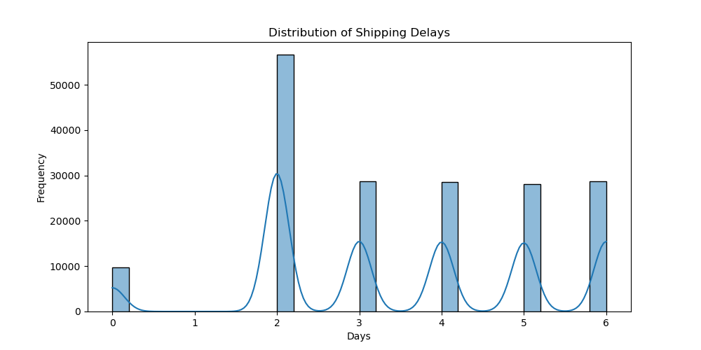
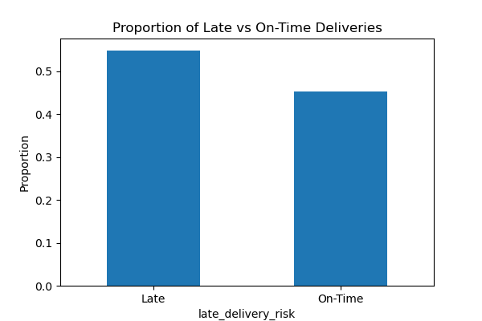
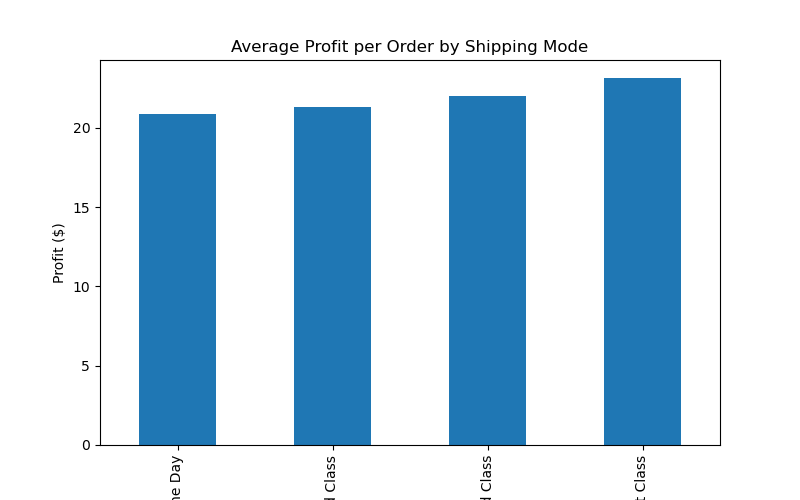

# DataCo Supply Chain Analysis

## Project Overview

This project analyzes supply chain performance using the DataCo Global Supply Chain dataset. The goal is to identify inefficiencies in shipping operations, evaluate delivery performance, and assess the business impact of late deliveries.

---

## Key Objectives

* Analyze shipping performance and delays
* Identify patterns in late deliveries
* Evaluate the impact of delays on profitability
* Explore regional and product-level differences

---

## Tools & Technologies

* Python (Pandas, NumPy)
* Matplotlib & Seaborn
* Jupyter Notebook

---

## Key Findings

* ~55% of deliveries are late, indicating systemic inefficiencies
* Late deliveries are associated with approximately $0.78 lower profit per order (~$77K impact across the dataset)
* First Class shipping is the most profitable, while Same Day shipping is the least profitable
* Second Class shipping provides minimal benefit over Standard Class
* Delays are broadly distributed across regions rather than isolated
* Bulky product categories show higher late delivery risk

---

## Visualizations

### Shipping Delay Distribution

### Late vs On-Time Deliveries

### Profit by Shipping Mode

---

## Project Structure

* `notebooks/` — Data exploration and analysis
* `data/` — Raw and processed data
* `data/processed/` — Placeholder for cleaned datasets (not used in this version)
* `visuals/` — Saved charts and figures
* `src/` — PLaceholder for modular Python scripts (future pipeline development)

---

## Next Steps

* Build predictive models for late delivery classification
* Expand analysis with multi-table datasets (e.g., Olist dataset)
* Develop an interactive dashboard (Power BI/Tableau)
